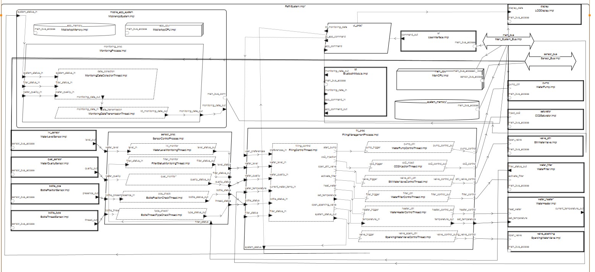
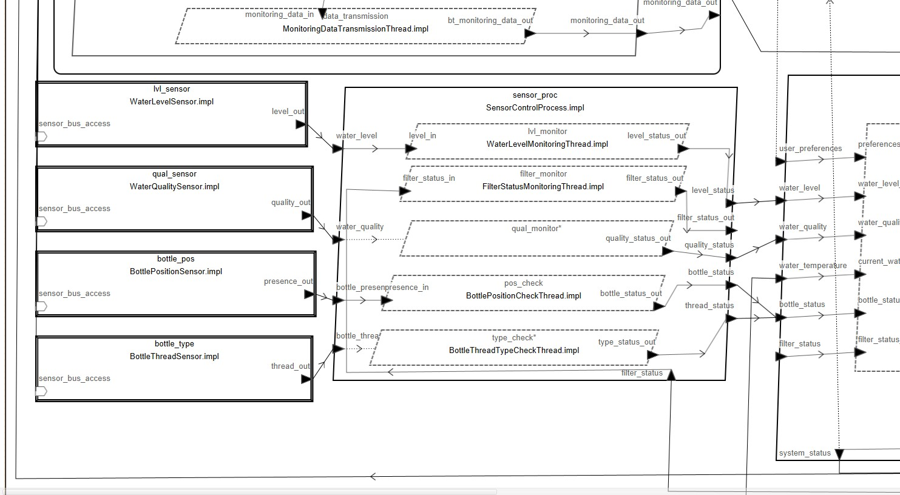
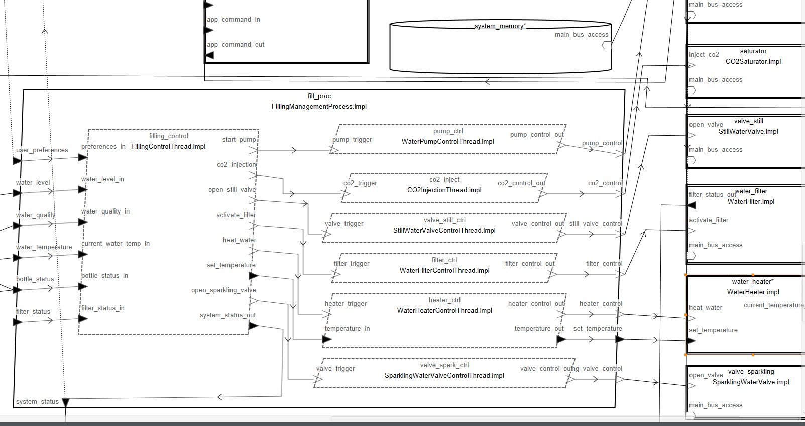
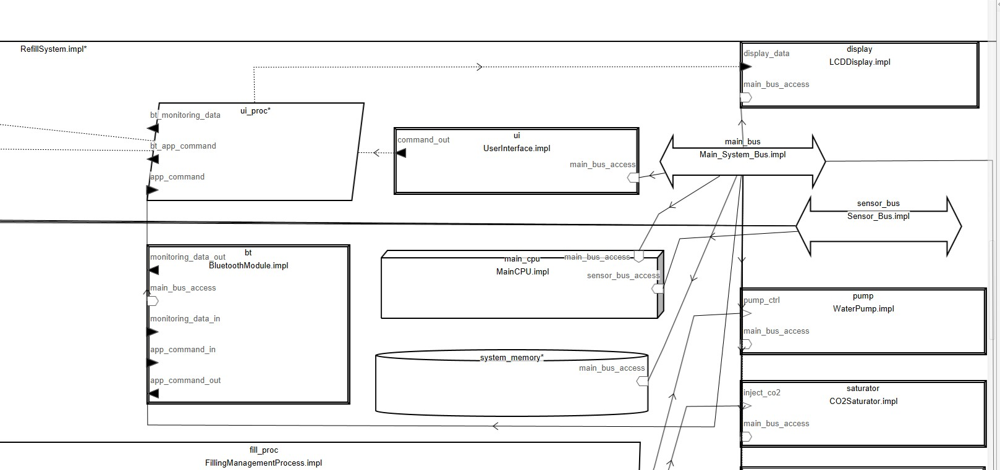
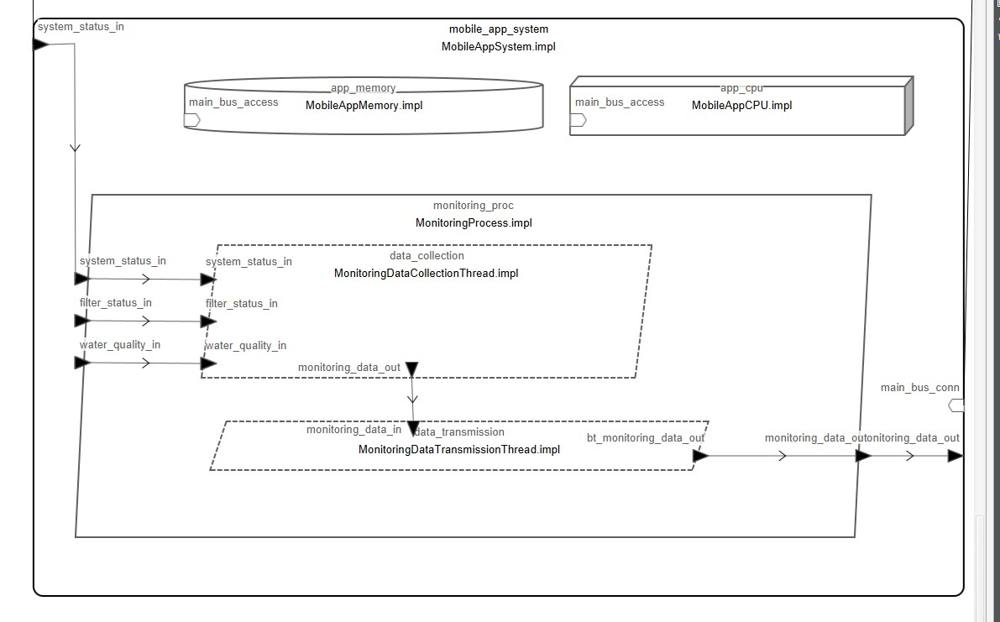
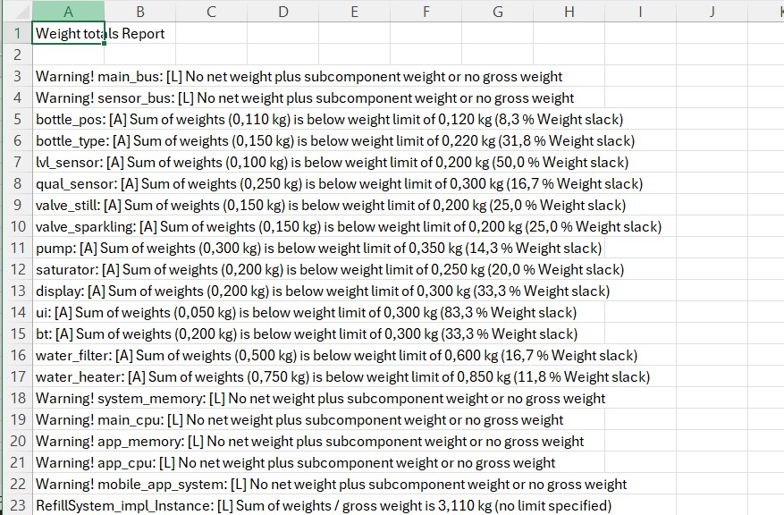
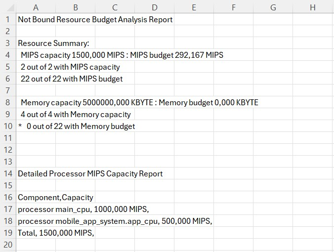

## Inteligentny automat do napełniania wodą butelek wielokrotnego użytku

### Projekt realizowany w ramch przedmiotu systemy czasu rzeczywistego przy użyciu architektury AADL

#### Imię i Nazwisko:
Krzysztof Nikodem

#### Mail:

knikodem@student.agh.edu.pl

#### Opis projektu:

System umożliwia użytkownikowi napełnianie/uzupełnianie wodą butelki wielokrotnego użytku. Urządzenie rozpoznaje obecność butelki, jej typ, dobiera ilość i rodzaj wody (gazowana/niegazowana), kontroluje jej poziom i jakość przy pomocy sensorów. System wyposażony jest w filtr wody oraz podgrzewacz umożliwiający uzyskanie wody o pożądanej temperaturze. Automat posiada interfejs użytkownika oraz możliwość zdalnego monitorowania i zbierania danych diagnostycznych.

#### Przykładowe wykorzystanie proponowanego systemu przez użytkownika:

Użytkownik podkłada butelkę pod dyszę. System rozpoznaje obecność i typ butelki, wyświetla opcje wyboru (typ wody, ilość, stopień gazowania, temperatura) na ekranie automatu. Po wprowadzeniu preferencji system filtruje wodę, podgrzewa ją do wybranej temperatury, a następnie napełnia butelkę, dodając CO2 jeśli wybrano wodę gazowaną. System monitoruje cały proces i informuje o jego zakończeniu. Dane o użyciu systemu są zbierane do celów diagnostycznych.

#### System realizuje następujące funkcje:

1. Wykrywanie obecności i typu butelki
2. Filtrowanie wody wejściowej dla zapewnienia jakości
3. Podgrzewanie wody do temperatury wybranej przez użytkownika
4. Napełnianie butelki wodą niegazowaną lub gazowaną (z dodaniem CO2)
5. Monitorowanie parametrów wody (pH, temperatura, mętność, przewodność)
6. Monitorowanie stanu filtra wody
7. Zapewnienie interfejsu użytkownika (wyświetlacz LCD, przyciski)
8. Zbieranie danych diagnostycznych do celów serwisowych

## Typy Danych [Data]

| Typ Danych | Opis |
|------------|------|
| `Timestamp` | Dane czasowe (rok, miesiąc, dzień, godzina, minuta, sekunda) |
| `BottlePresenceData` | Flaga obecności butelki (typ boolean) |
| `BottleTypeData` | Typ gwintu butelki (wartość całkowita) |
| `WaterLevelData` | Poziom wody (wartość zmiennoprzecinkowa) |
| `WaterQualityData` | Dane z sensorów jakości wody (temperatura, pH, mętność, CO2, przewodność, zasolenie) |
| `UserPreferencesData` | Preferencje użytkownika (preferowana temperatura, poziom CO2, poziom pH) |
| `CO2LevelData` | Stan zasobnika CO2 (wartość całkowita) |
| `SystemStatusData` | Status systemu, błędy, ostrzeżenia (wartość całkowita) |
| `UICommandData` | Komendy z interfejsu użytkownika (wartość całkowita) |
| `MobileAppCommandData` | Dane komunikacyjne z aplikacji mobilnej (wartość całkowita) |
| `WaterSensorPacket` | Pakiet danych z czujników wody (jakość, poziom, znacznik czasowy) |
| `MonitoringData` | Dane monitorujące (znacznik czasowy, identyfikator maszyny, status, kod błędu, licznik użycia) |
| `FilterStatusData` | Status filtra wody (pozostały czas życia, data ostatniej wymiany, ciśnienie, przepływ) |
| `WaterTemperatureData` | Dane o temperaturze wody (wartość zmiennoprzecinkowa) |

## Urządzenia [Devices]

| Urządzenie | Opis |
|------------|------|
| `BottlePositionSensor` | Sensor pozycji/położenia butelki |
| `BottleThreadSensor` | Czujnik typu gwintu butelki |
| `WaterLevelSensor` | Sensor poziomu wody w butelce |
| `WaterQualitySensor` | Sensor jakości wody |
| `StillWaterValve` | Zawór wody niegazowanej |
| `SparklingWaterValve` | Zawór wody gazowanej |
| `WaterPump` | Pompa ciśnienia |
| `CO2Saturator` | Moduł saturatora CO2 |
| `LCDDisplay` | Wyświetlacz LCD |
| `UserInterface` | Fizyczny interfejs użytkownika |
| `BluetoothModule` | Moduł Bluetooth |
| `WaterFilter` | Filtr wody |
| `WaterHeater` | Podgrzewacz wody |

## Wątki [Threads]

| Wątek | Opis |
|-------|------|
| `BottlePositionCheckThread` | Wykrywanie obecności butelki |
| `BottleThreadTypeCheckThread` | Rozpoznawanie typu gwintu butelki |
| `WaterLevelMonitoringThread` | Pomiar poziomu wody |
| `WaterQualityMonitoringThread` | Pomiar parametrów jakości wody |
| `FillingControlThread` | Koordynacja procesu napełniania |
| `WaterPumpControlThread` | Zarządzanie pompą ciśnienia |
| `StillWaterValveControlThread` | Obsługa zaworu wody niegazowanej |
| `SparklingWaterValveControlThread` | Obsługa zaworu wody gazowanej |
| `CO2InjectionThread` | Obsługa saturatora i nasycanie CO2 |
| `LCDDisplayThread` | Wyświetlanie komunikatów na ekranie |
| `PhysicalButtonHandlerThread` | Obsługa fizycznych przycisków automatu |
| `BluetoothCommunicationThread` | Komunikacja przez Bluetooth |
| `MonitoringDataCollectionThread` | Zbieranie danych diagnostycznych |
| `MonitoringDataTransmissionThread` | Przygotowanie danych do transmisji |
| `WaterFilterControlThread` | Sterowanie filtrem wody |
| `WaterHeaterControlThread` | Sterowanie podgrzewaczem wody |
| `FilterStatusMonitoringThread` | Monitorowanie stanu filtra wody |

## Procesy [Processes]

### FillingManagementProcess
Zarządza procesem napełniania butelki zgodnie z preferencjami użytkownika, kontrolując:
- Pompę wody
- Zawory wody (gazowanej i niegazowanej)
- Saturator CO2
- Filtr wody
- Podgrzewacz wody

### SensorControlProcess
Zbiera i analizuje dane z czujników:
- Obecności butelki
- Typu butelki
- Poziomu wody
- Jakości wody
- Stanu filtra

### UserInterfaceProcess
Zarządza interakcją z użytkownikiem:
- Wyświetlanie informacji na LCD
- Obsługuje przycisków fizycznych

## Procesory [Processors]

| Procesor | Opis |
|----------|------|
| `MainCPU` | Główny procesor systemu |
| `MobileAppCPU` | Procesor modułu danych aplikacji |

## Magistrale [Bus]

| Magistrala | Opis | Parametry |
|------------|------|-----------|
| `Main_System_Bus` | Główna magistrala systemowa | Przepustowość: 2.0 MB/s |
| `Sensor_Bus` | Dedykowana magistrala sensorów | Przepustowość: 1.0 MB/s |

## Pamięć [Memory]

| Pamięć | Opis | Parametry |
|--------|------|-----------|
| `SystemMemory` | Główna pamięć operacyjna | Rozmiar: 4 GB |
| `MobileAppMemory` | Pamięć podsystemu monitorowania | Rozmiar: 1 GB |

## System [System]

### MobileAppSystem
Podsystem odpowiedzialny za zbieranie i przygotowanie danych diagnostycznych.

### RefillSystem
Kompletny system integrujący wszystkie komponenty:
- Urządzenia fizyczne
- Procesy
- Magistrale
- Procesory i pamięć

### Model - diagramy:

### Diagram przedstawiający całość systemu:

### Diagram procesu odpowiadającego za zebranie danych z czujników i sensorów:

### Diagram procesu odpowiadajacego za napełnianie butelki:

### Diagram przedstawiający interfejs zbierania danych oraz główną pamięć, procesor i magistrale systemu:

### Diagram przedstawiający podsystem odpowiedzialny za segregację i przesyłanie danych do aplikacji:

### Przprowadzone wybrane analizy osate:

### Analiza Wight Total Report:

### Analiza Budget Analysis Report:

### Litertura:

[Water bottle filling system](https://www.irjmets.com/uploadedfiles/paper//issue_4_april_2025/75102/final/fin_irjmets1746646231.pdf)

Title: AUTOMATED WATER BOTTLE FILLING SYSTEM USING ARDUINO UNO CONTROLLER

Authors: Pravin S. Wankhade, Rohit R. Dabhade, Gopal K. Chavhan,
Karan P. Ade, Rajdip V. Jadhao

[Liquid filling system](https://www.irjmets.com/uploadedfiles/paper/issue_4_april_2023/35511/final/fin_irjmets1680943442.pdf)

Title:  AUTOMATIC LIQUID FILLING SYSTEM FOR BOTTLE USING PLC

Authors: Prof. Sanaulla Sheikh, Mr. Saurabh S. Kale, Mr. Aditya S. Wakade,
Mr. Chaitanya R. Chafle, Mr. Prabuddha A. Gedam, Mr. Viraj V. Kolhe

[Smart water dispenser](https://thesai.org/Downloads/Volume15No12/Paper_52-Development_of_a_Smart_Water_Dispenser.pdf)

Title: Development of a Smart Water Dispenser Based onObject Recognition with Raspberry Pi 4

Authors: Dani Ramdani, Puput Dani Prasetyo Adi, Andriana, Tjahjo Adiprabowo,Yuyu Wahyu, Arief Suryadi Satyawan, Sally Octaviana Sari, Zulkarnain, Noor Rohman

[Monitoring system for fluid quality](https://arxiv.org/pdf/2210.06285)

Title: Smart Cup An impedance sensing based fluid intake monitoring system for beverages classification and freshness detection

Authors: MENGXI LIU, SIZHEN BIAN, BO ZHOU, AGNES GRÜNERBL, and PAUL LUKOWICZ, German

[Osate, AADL documentation](https://osate.org)

